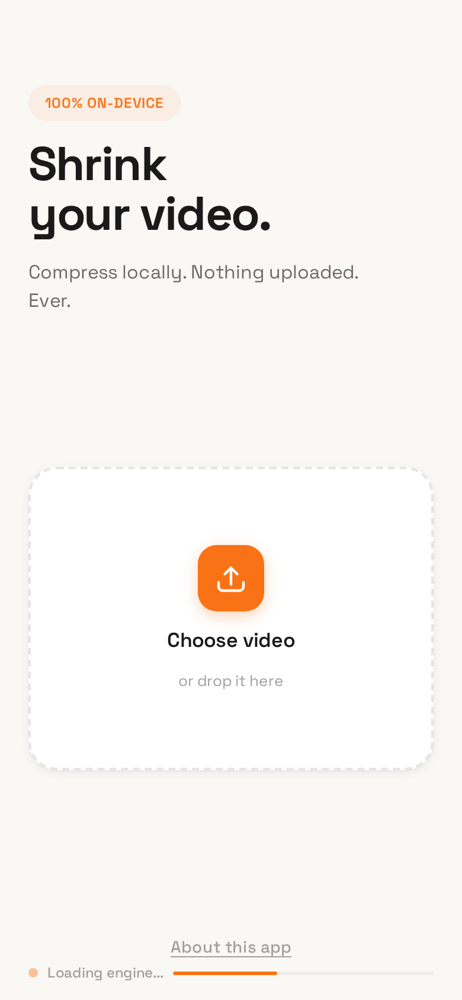

# Compress

**Shrink your videos. Nothing uploaded. Ever.**

A video compression PWA that runs entirely in your browser using FFmpeg compiled to WebAssembly. No servers, no uploads, no accounts, no ads.

<p align="center">
  
</p>

<p align="center">
  <a href="https://compress.applesauce.chat">compress.applesauce.chat</a>
</p>

---

## How it works

1. Pick a video from your device
2. Choose a quality preset (High / Medium / Low / Under 10 MB)
3. FFmpeg.wasm compresses it right in your browser
4. Save or share the result

The ~31 MB FFmpeg engine downloads once and gets cached by the service worker. After that, compression works offline.

## Features

- **100% on-device** — your video never leaves your phone or computer
- **Installable PWA** — add to home screen for a native app experience
- **Quality presets** — High (CRF 23), Medium (CRF 28), Low (CRF 35), or target file size
- **File size estimation** — quick heuristic + sample-based test encoding
- **Detailed stats** — input/output bitrate, compression ratio, codec info, encoding speed
- **Background compression** — wake lock keeps the device awake, notification when done
- **Offline support** — service worker caches everything after first load

## Privacy & Security

- Zero network requests during compression — all processing is local WebAssembly
- No analytics, no tracking, no cookies (except the service worker cache)
- No authentication, no user data stored
- Source code is fully auditable in this repo

## Tech stack

| Component | Technology |
|-----------|-----------|
| Compression | [FFmpeg.wasm](https://github.com/ffmpegwasm/ffmpeg.wasm) (v0.12) — H.264 via libx264 |
| Frontend | Vanilla JS, no frameworks, no build step |
| Styling | Custom CSS with CSS variables |
| Font | [Space Grotesk](https://fonts.google.com/specimen/Space+Grotesk) |
| PWA | Service worker + web app manifest |
| Hosting | Static files behind Caddy |

## Run locally

```bash
git clone https://github.com/Tsangares/compress.git
cd compress
```

Download FFmpeg.wasm UMD files into `lib/`:

```bash
mkdir -p lib
curl -o lib/ffmpeg.js "https://unpkg.com/@ffmpeg/ffmpeg@0.12.10/dist/umd/ffmpeg.js"
curl -o lib/814.ffmpeg.js "https://unpkg.com/@ffmpeg/ffmpeg@0.12.10/dist/umd/814.ffmpeg.js"
curl -o lib/util.js "https://unpkg.com/@ffmpeg/util@0.12.1/dist/umd/util.js"
curl -o lib/ffmpeg-core.js "https://unpkg.com/@ffmpeg/core@0.12.6/dist/umd/ffmpeg-core.js"
curl -o lib/ffmpeg-core.wasm "https://unpkg.com/@ffmpeg/core@0.12.6/dist/umd/ffmpeg-core.wasm"
```

Serve with any static file server:

```bash
python3 -m http.server 8000
```

Open `http://localhost:8000` in your browser.

## License

MIT
